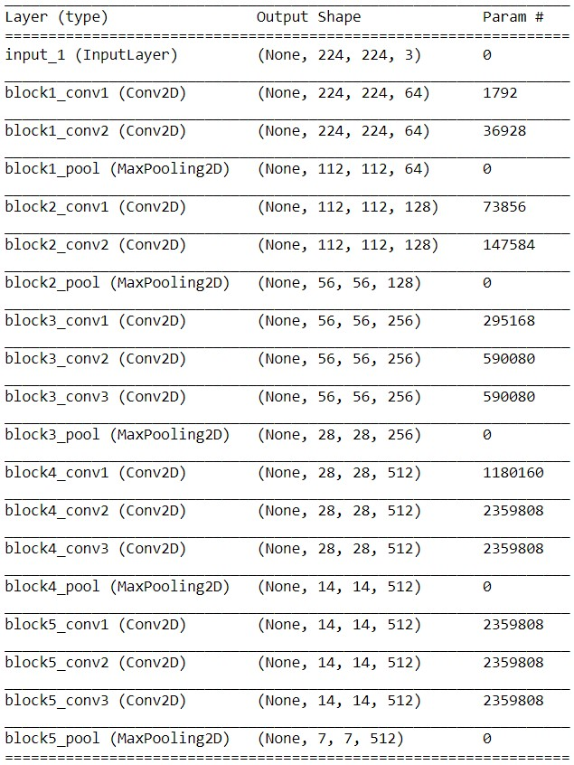
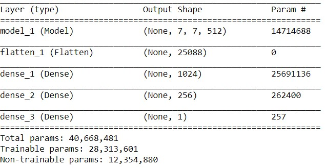
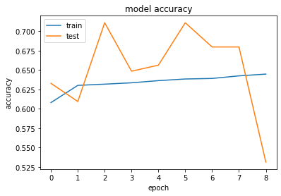
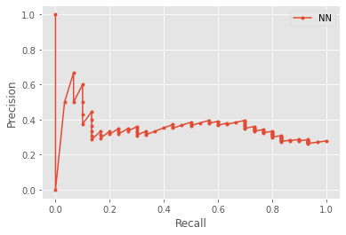
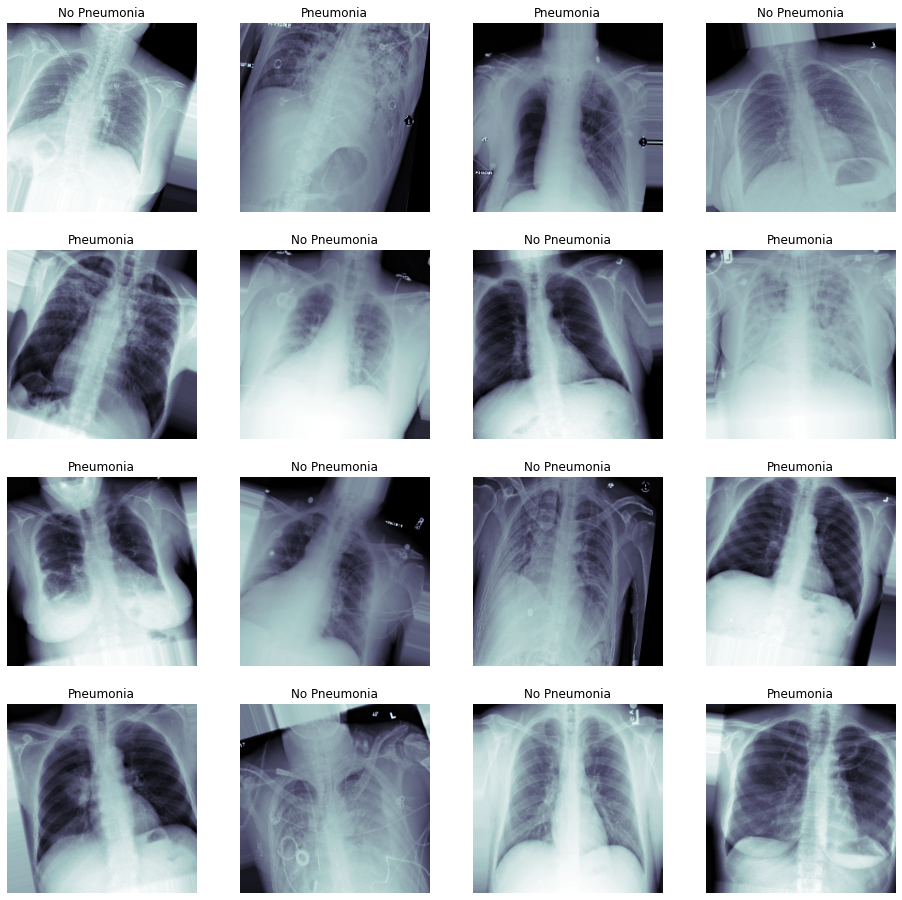

# FDA  Submission

**Your Name:** Ilkka Kosunen

**Name of your Device:**
Pneumonia detection algorithm

## Algorithm Description 

### 1. General Information

**Intended Use Statement:** 

The intended use of the algorithm is to help radiologist to decide whether a patient might be suffering from pneumonia. The algorithm is only giving a radiologist additional source of information so that they can make the final, informed decision. The algorithm is meant to be used for adult male and female patients younger than 80 years old.

**Indications for Use:**
Additional diagnostic aid that can be used whenever chest x-rays are taken to alert the radiologist to take a closer look at images the algorithm finds suspicious.

**Device Limitations:**
Currently the algorithm detects not only pneumonia but also pneumothorax and infiltration. The radiologist using the algorithm have to make the final classification between these cases. In case of a false positive, the radiologist will notice that the algorithm incorrectly recognized pneumonia, and make the correct diagnosis. Similarly, even if the algorithm has a false negative and does not detect a case of pneumonia, the radiologist will still be able to make the correct diagnosis, as they are not solely relying on the algorithm, but simply use it as one of multiple sources of information based on which they make their final expert decision.

***Computational limitations***

The algorithm uses a trained neural network so the running time of the algorithm is not an issue (as the training is the time consuming part). However, the algorithm needs an environment with sufficient memory and computing power to run a full convolutional neural network, and it also requires a Python run time. This limits the use of the algorithm to computers and special edge devices: it is not possible to deploy the algorithm to most embedded devices as is.

**Clinical Impact of Performance:**
In case of a false positive, the radiologist will notice that the algorithm incorrectly recognized pneumonia, and make the correct diagnosis. Similarly, even if the algorithm has a false negative and does not detect a case of pneumonia, the radiologist will still be able to make the correct diagnosis, as they are not solely relying on the algorithm, but simply use it as one of multiple sources of information based on which they make their final expert decision.
	

### 2. Algorithm Design and Function

<< Insert Algorithm Flowchart >>
The algorithm consists of VGG16 backbone:

on top of which a another classification network is
added to enable transfer learning:

**DICOM Checking Steps:**
When processing the DICOM images we first check that the
image is an X-ray and from the chest region. We further
check that the patient position is valid.

**Preprocessing Steps:**

The image pixel luminances are normalized using the 
mean values obtained during exploratory data analysis. 
That is, we mean center the pixel values around the baseline
mean, and then divide them with the baseline standard deviation.

**CNN Architecture:**

The CNN architecture consists of a VGG16 backbone on top
of which we insert several fully connected layers enabling
us to do transfer learning from a network that wes pre-trained
on the ImageNet dataset.

### 3. Algorithm Training

**Parameters:**
* Types of augmentation used during training
  During the training the images were first scaled to 
  values between 0 and 1 from the original 0-255 range.
  We allowed Keras image augmentator shift the height and
  width with fraction of 0.1. Also, rotation was allowed up to
  20 degrees of the original. For shear and zoom the 0.1 was
  also used.
  
* Batch size
  
  For training we used batch size of 128.
  
* Optimizer learning rate
  
  The optimizer learning rate was set to 1e-5.
  
* Layers of pre-existing architecture that were frozen
  As shown in the layer image on the algorithm section of this
  document, the layers of the VGG16 were frozen until the 
  Bool-5 maxpooling layer.
* Layers of pre-existing architecture that were fine-tuned
  The pre-existing architecture was not fine-tuned
* Layers added to pre-existing architecture
  Three new fully connected layers were added to the model,
  first one containing 1024 output with ReLU activation, second 
  with 256 outputs which was also using ReLU and finally the 
  binary classifier layer using sigmoid activation function.
  
<< Insert algorithm training performance visualization >> 

<< Insert P-R curve >>

**Final Threshold and Explanation:**
As the final threshold I chose 0.427, as this was the value
of geometric mean and the J statistic.

### 4. Databases
 (For the below, include visualizations as they are useful and relevant)

The dataset consist of 112120 X-ray images curated by NIH, and contain images from 30805 unique
patients. The dataset contains several diseases, but here we are focusing on detecting 
pneumonia. Below is a sample of images from both pneumonia and no-pneumonia classes.

**Description of Training Dataset:** 
The training dataset consisted of 45092 randomly sampled images
that were labeled either as "Pneumonia", "Pneumothorax" or 
"Infiltration"

**Description of Validation Dataset:** 

Validation dataset was similar to the training dataset, and the number of
positive and negative cases were the same as in the whole population to
achieve ecological validity.

### 5. Ground Truth

The ground truth was obtained using NLP methods on the 
radiology reports, and it is estimated that the error
rate might up to 10% which sets a limitation for the upper-bound
performance of the model. Ideally, we would like to have a
human-expert labeled dataset that would hopefully be
close to 100% correct.

### 6. FDA Validation Plan

**Patient Population Description for FDA Validation Dataset:**
The patient population consisted of patients, both men and female, of ages between
18 and 80. 
**Ground Truth Acquisition Methodology:**
Ground truth was acquired using NLP techniques on the radiology reports

**Algorithm Performance Standard:**

Based on the paper by Rajpurkal et al. (Rajpurkak 2017), we can see that previous
attempts in detecting Pneumonia have reached AUC scores 0.633 (Wang et al 2017),
0.713 (Yao et al.) and 0.7680. Therefore, our model should achieve at least the same
level os 0.633 of Wang et al. to be comparable to the current state of the art.

References:

Rajpurkar, P., Irvin, J., Zhu, K., Yang, B., Mehta, H., Duan, T., Ding, D., Bagul, A., Langlotz, C., Shpanskaya, K. and Lungren, M.P., 2017. Chexnet: Radiologist-level pneumonia detection on chest x-rays with deep learning. arXiv preprint arXiv:1711.05225.

Yao, Li, Poblenz, Eric, Dagunts, Dmitry, Covington,  Ben, Bernard, Devon, and Lyman, Kevin. Learning  to diagnose from scratch by exploiting dependencies among labels. arXiv preprint arXiv:1710.10501, 2017.

Wang, Xiaosong, Peng, Yifan, Lu, Le, Lu, Zhiyong,
Bagheri, Mohammadhadi, and Summers, Ronald M.
Chestx-ray8: Hospital-scale chest x-ray database
and benchmarks on weakly-supervised classification
and localization of common thorax diseases. arXiv
preprint arXiv:1705.02315, 2017